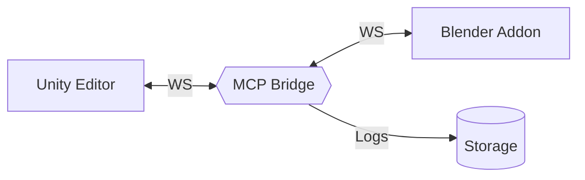

# Arquitectura — Resumen técnico

La solución consta de Unity (C#), MCP Bridge (Python) y el Addon de Blender (Python), comunicados principalmente por WebSocket.

- Detalle: `docs/architecture/overview.md`
- Flujo de comunicación: `docs/architecture/communication_flow.md`
- Componentes: `docs/architecture/components.md`
- Seguridad: `docs/architecture/security.md`

