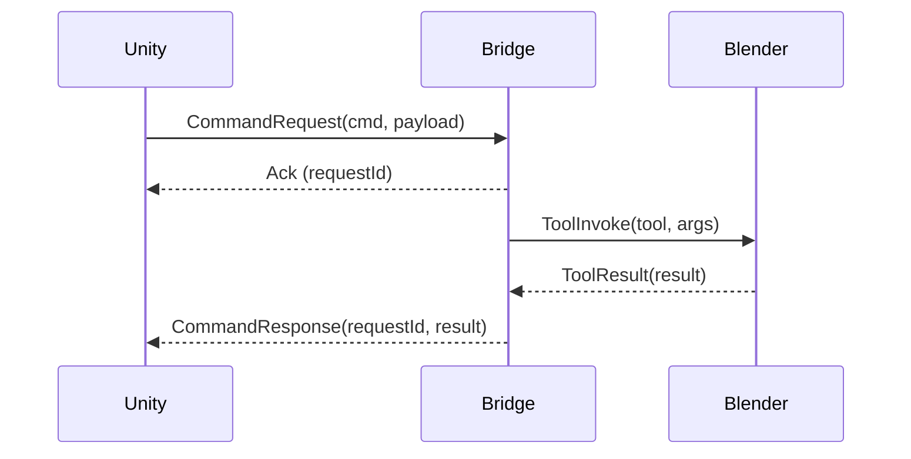

# Flujo de comunicación

- Protocolos: WebSocket (JSON) para comandos, HTTP opcional para recursos.
- Trazabilidad: cada request posee `requestId` para correlación.
- Manejo de errores: códigos y descripciones estandarizadas.

