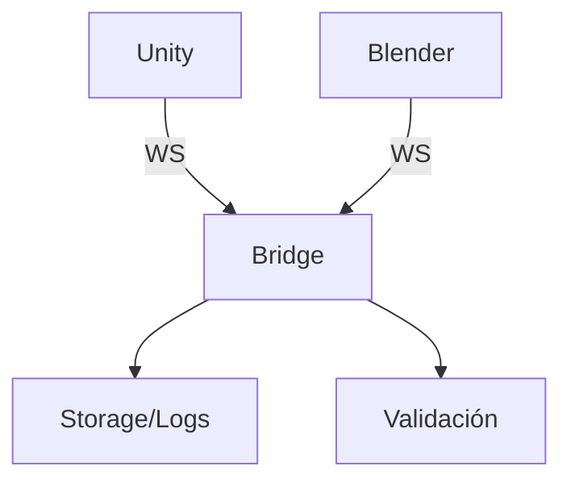

# Componentes

- Unity Editor (C#):
  - `MCPWebSocketClient` gestiona conexión y mensajería.
  - `CommandDispatcher` enruta y valida comandos.
  - `MCPToolbox` catálogo de operaciones/editor tools.
- MCP Unity Bridge (Python):
  - `mcp_unity_server.main` servidor y endpoints.
  - `logging_system/*` agregación y persistencia de logs.
  - `config_manager` y `models`: configuración y tipos.
- Blender Addon (Python):
  - `server/*` ejecución, registro, validación de comandos.
  - `commands/*` operaciones de modelado/escena.

