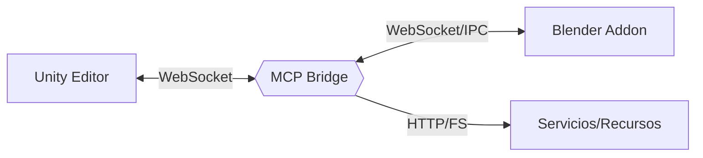
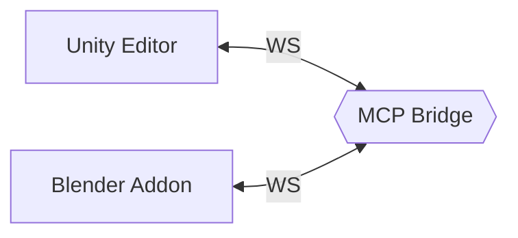

# Arquitectura: Visión general

La arquitectura conecta tres pilares:

- Unity Editor (C#) con un cliente WebSocket y un conjunto de comandos de editor.
- MCP Unity Bridge (Python) que orquesta peticiones, logging y validación.
- Blender Addon (Python) que expone comandos de modelado y utilidades.

El Bridge centraliza validación, logging y coordinación, reduciendo acoplamiento entre Unity y Blender.

<!-- AUTO:ARCH_INVENTORY -->

<!-- AUTO:ARCH_INVENTORY:END -->
