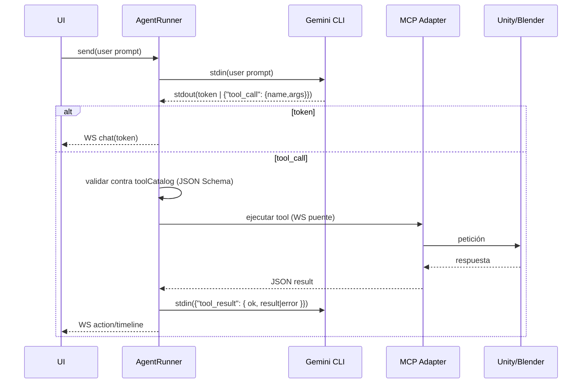

# Arquitectura del Dashboard (Gateway)

```mermaid
flowchart LR
  subgraph UI[Web UI (React/Vite)]
    A[HTTP: REST]
    B[WS: /ws/events?project_id]
  end

  A -->|/api/v1/*| GW[(AI Gateway FastAPI)]
  B -->|Rooms por proyecto| GW

  subgraph GWINT[Gateway Interno]
    R[Routers: projects, agent, sessions, tasks, health, ...]
    S[Services: AgentRunner, ProviderRegistry, ToolCatalog, SessionsService, Health]
    DB[(SQLite: projects, sessions, agent_messages, artifacts, timeline)]
  end

  GW --> R
  R --> S
  S --> DB

  subgraph AGENT[Agente CLI (provider: gemini_cli)]
    CWD[cwd=projects/<id>]
    CLI[Gemini CLI]
  end

  S -.start/stop/send.-> CLI
  CLI -.stdout/stderr stream.-> S

  subgraph MCP[MCP Adapter + Bridges]
    AD[Adapter MCP (stdio)]
    U[Unity Bridge (WS)]
    BL[Blender Add-on (WS)]
  end

  S -->|lockfile + PID| AD
  AD -->|WS| U
  AD -->|WS| BL

  S -->|Envelope (events)| B
```

Notas clave:
- WS usa salas por `project_id` y un Envelope unificado (`type`, `project_id`, `payload`, `correlationId`, `timestamp`).
- `AgentRunner` gestiona el provider (Gemini CLI), arranca el MCP Adapter con lockfile único y orquesta el shim de function-calling.
- `ProviderRegistry` permite añadir futuros providers sin cambiar el Runner.
- `SessionsService` persiste sesiones, mensajes y artefactos; construye Context Packs para reanudar.
- `ToolCatalog` inspecciona el Adapter y genera `promptList` + `functionSchema` con cache y versión.

## Secuencia: tool-call shim



